## Recon

```bash
nmap -sC -sV -p- 10.10.11.143 -v
```

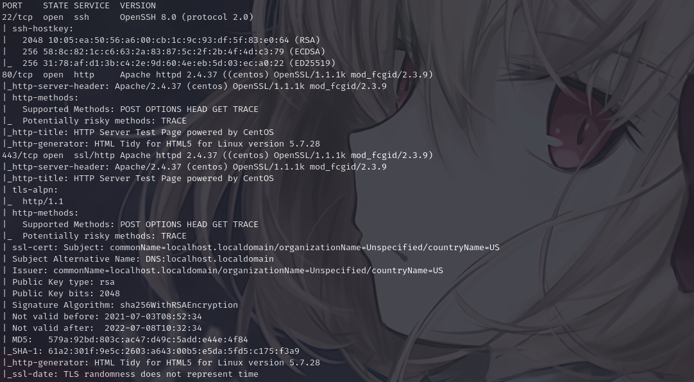

---

## Enumeration

### Web (port 80)

We did not find anything manually with tools such as ffuf, so we used whatweb to attempt to obtain useful information. As part of the output, a domain was discovered near the end:

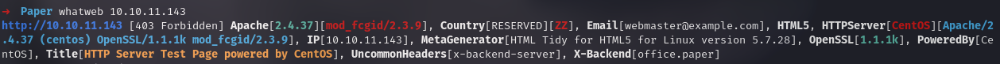

```
office.paper
```

We are dealing with a WordPress instance.

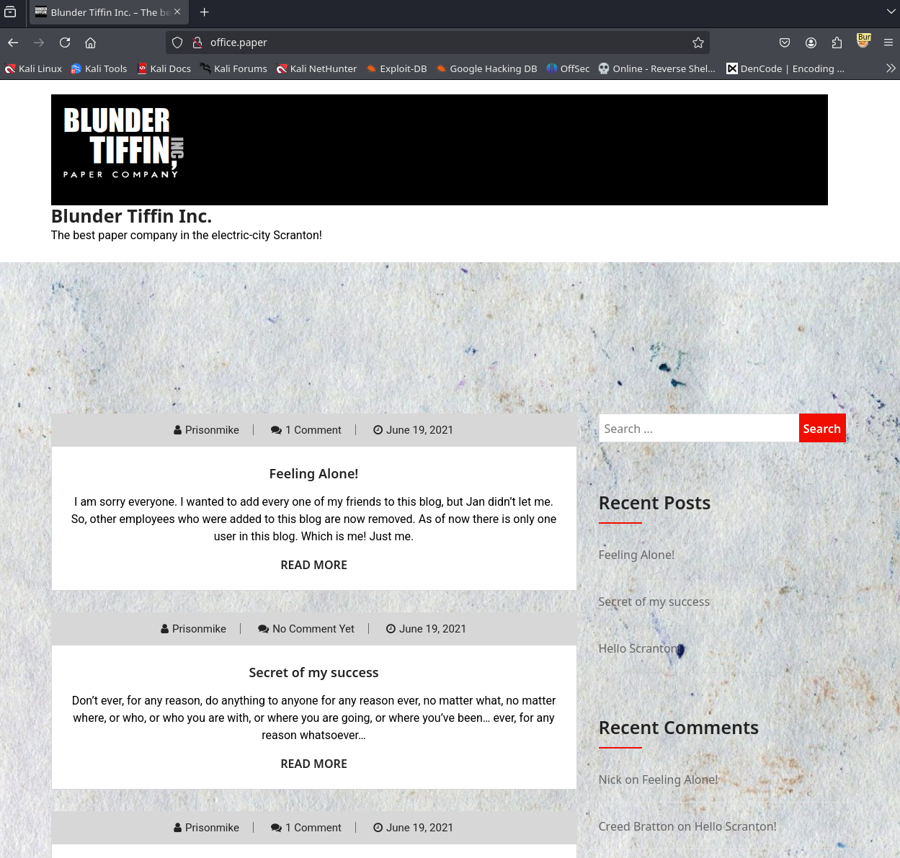

Reading the server content, We found a message that provided a hint indicating a possible vulnerability.

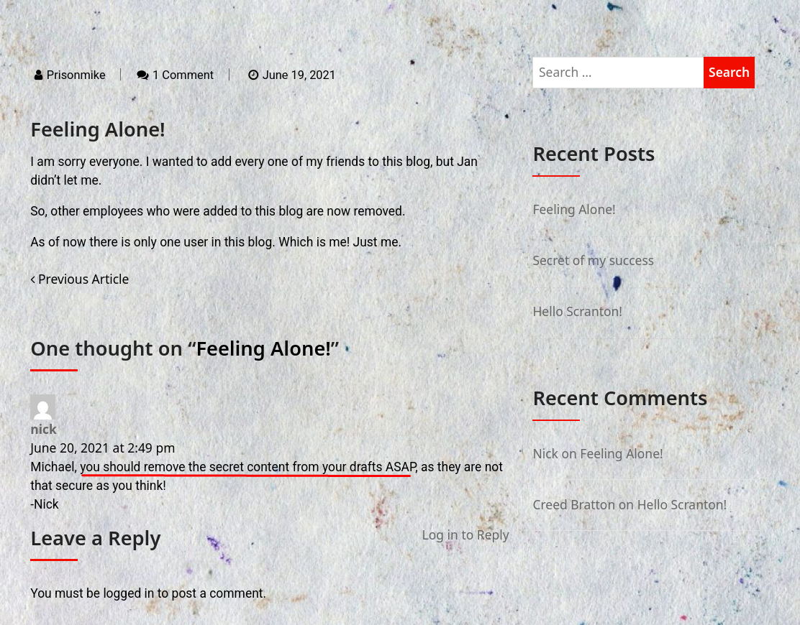

Consulting the referenced article, We identified the vulnerability that was being referenced:

https://0day.work/proof-of-concept-for-wordpress-5-2-3-viewing-unauthenticated-posts/

We tested the behavior on the target server:

```
http://office.paper/?static=1
```

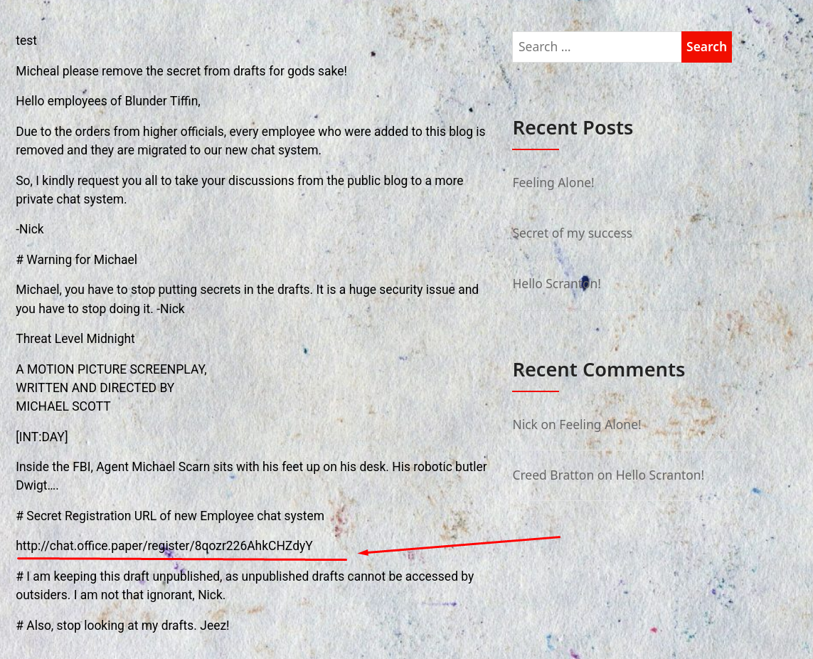

We obtained the following URL:

```
http://chat.office.paper/register/8qozr226AhkCHZdyY
```

We resolved that subdomain and accessed the secret registration area:

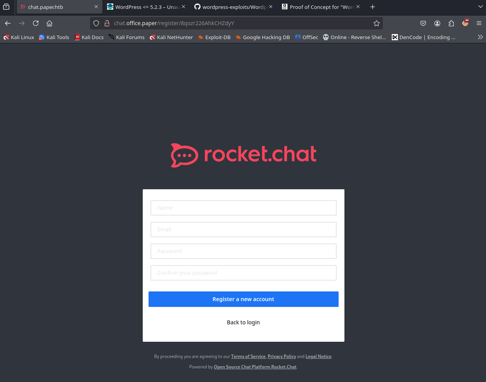

We created an account with the address polar@polar.com and the password polar. While exploring, We observed a chat bot accessible from the application:

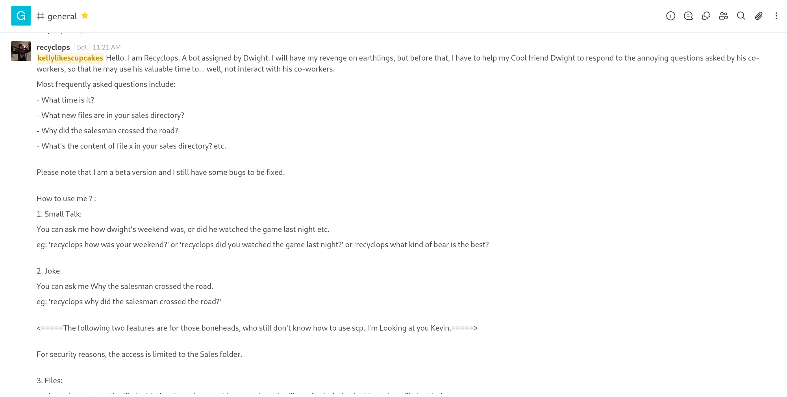

By inspecting user comments, We discovered a useful hint:

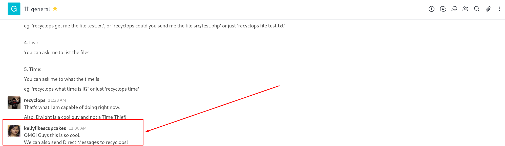

We proceeded to message the bot privately. The initial approach was to attempt an XSS; however, the bot responded with a set of available commands:

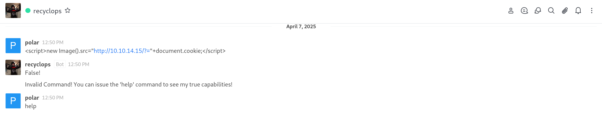

List of commands:

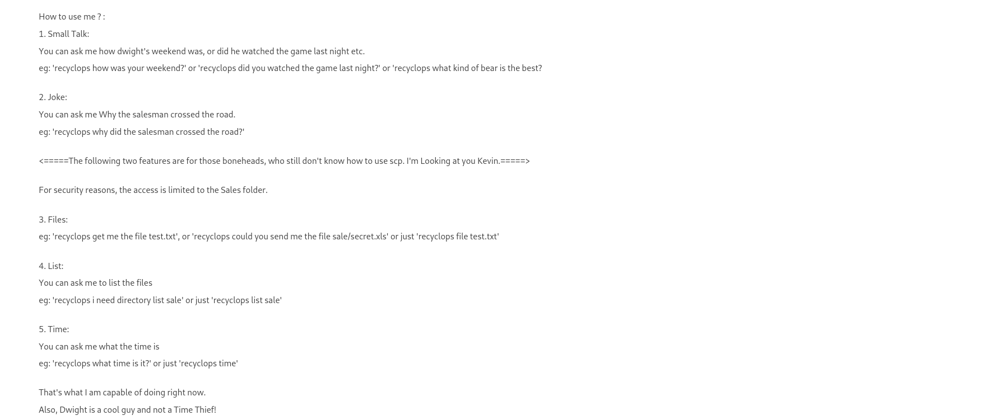

After further testing, We successfully achieved Local File Inclusion (LFI):

```
recyclops list ../../../../../../../home
```

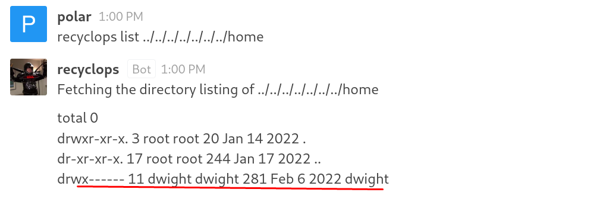

While using the bot's list and file commands, We discovered a .env file within the bot's directory that contained credentials:

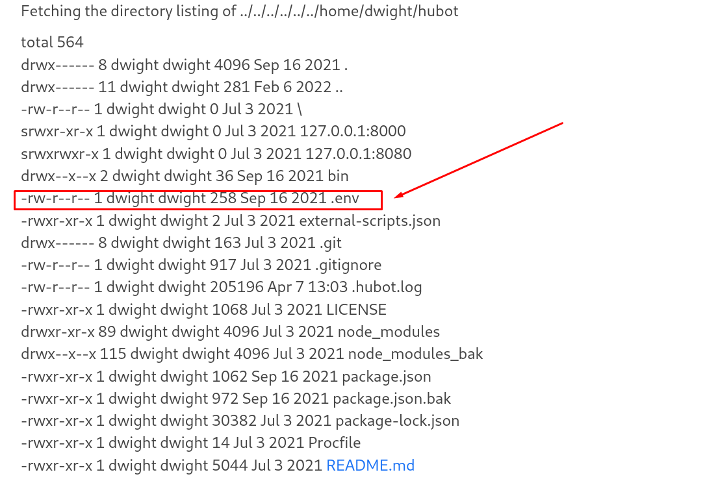

From the file, We observed a password:

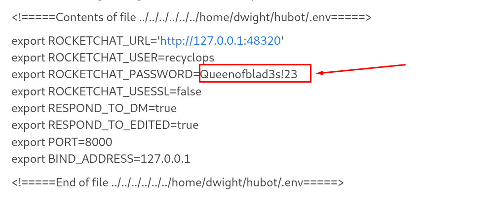

```
Queenofblad3s!23
```

The discovered credential permitted SSH access to the account dwight.

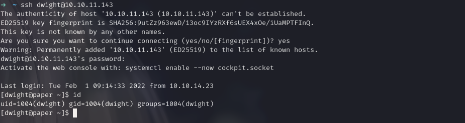

We retrieved user.txt:

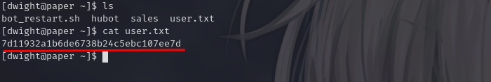

```
7d11932a1b6de6738b24c5ebc107ee7d
```

---

## Post Exploitation

### Root

Execution of LinPEAS revealed the following finding:

```
Vulnerable to CVE-2021-3560
```

To exploit the vulnerability, We referenced the following public exploit repository:

https://github.com/UNICORDev/exploit-CVE-2021-3560/blob/main/exploit-CVE-2021-3560.py

We transferred the exploit to the target and executed it:

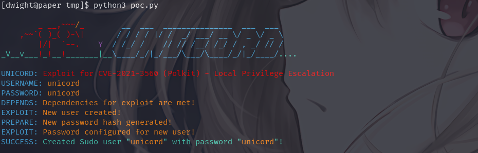

The compromised user possessed sudo privileges:

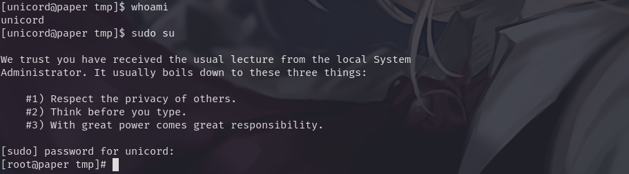

Consequently, We obtained the final flag:

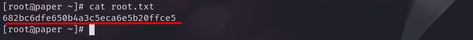

```
682bc6dfe650b4a3c5eca6e5b20ffce5
```
